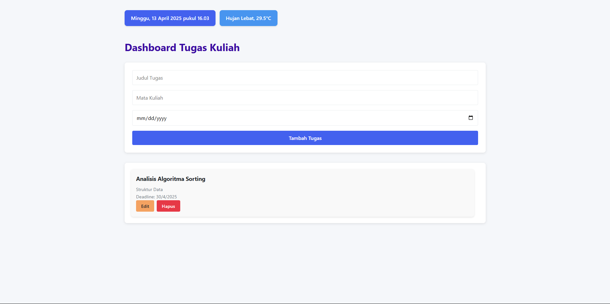

# Dashboard Tugas Kuliah

## Deskripsi Aplikasi

Aplikasi **Dashboard Tugas Kuliah** adalah aplikasi untuk membantu pengguna dalam mengelola tugas kuliah. Pengguna dapat menambahkan tugas kuliah dengan detail seperti judul, mata kuliah, dan deadline, serta dapat mengedit dan menghapus tugas yang sudah ditambahkan.

## Fitur Utama

- **Menambahkan Tugas Kuliah**: Pengguna dapat menambah tugas kuliah dengan memasukkan judul, mata kuliah, dan deadline.
- **Mengedit Tugas Kuliah**: Pengguna dapat mengedit tugas yang sudah ada.
- **Menghapus Tugas Kuliah**: Pengguna dapat menghapus tugas dari daftar.
- **Simpan Data Lokal**: Semua data tugas disimpan di `localStorage`, sehingga tugas tetap tersimpan meskipun halaman di-refresh.
- **Cuaca Lokal**: Menampilkan informasi cuaca lokal berdasarkan lokasi pengguna. Aplikasi ini akan mendeteksi lokasi pengguna dan menampilkan data cuaca terkini.

## Screenshot Aplikasi



## Fitur ES6+ yang Diimplementasikan

Berikut adalah beberapa fitur ES6+ yang digunakan dalam aplikasi ini:

1. **Arrow Functions**: Penggunaan fungsi panah (arrow function) untuk menulis fungsi yang lebih ringkas.
    ```js
    const hapusTugas = (id) => {
        // kode hapus tugas
    };
    ```

2. **Template Literals**: Menggunakan template literals untuk menggabungkan string dan variabel.
    ```js
    item.innerHTML = `
        <h3>${tugas.judul}</h3>
        <p>Matkul: ${tugas.matkul}</p>
        <p>Deadline: ${formatTanggal(tugas.deadline)}</p>
        <button data-id="${tugas.id}" class="hapus-btn">Hapus</button>
    `;
    ```

3. **Destructuring**: Destructuring digunakan untuk mengambil nilai dari objek secara langsung.
    ```js
    const { latitude, longitude } = await getLocation();
    ```

4. **Default Parameters**: Penggunaan parameter default di fungsi untuk menangani kasus di mana parameter tidak diberikan.
    ```js
    function sayHello(name = "User") {
        console.log(`Hello, ${name}!`);
    }
    ```

5. **Async/Await**: Digunakan untuk menangani operasi asynchronous secara lebih mudah dan lebih jelas.
    ```js
    const waktu = await getWaktuLokal();
    ```

6. **Modules (ES6)**: Menggunakan modul JavaScript untuk memisahkan kode dalam file yang berbeda.
    ```js
    import { Tugas, ambilData, simpanData } from "./modules/data.js";
    ```

7. **Let & Const**: Menggunakan `let` dan `const` untuk deklarasi variabel yang lebih tepat (menghindari penggunaan `var`).
    ```js
    const form = document.getElementById("form-tugas");
    let semuaTugas = ambilData();
    ```
