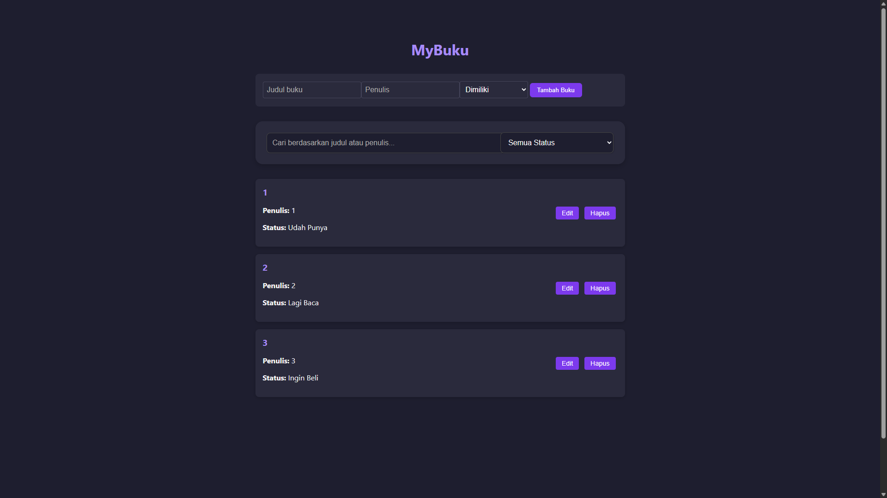
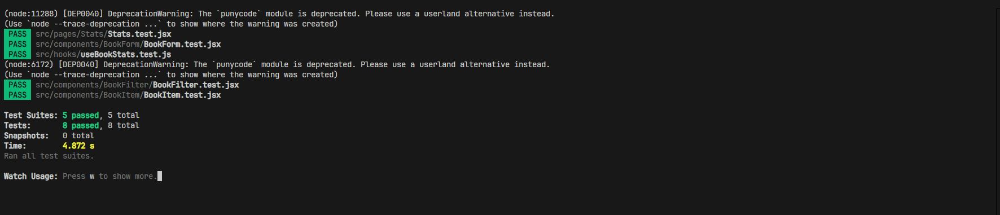

#  Aplikasi Manajemen Buku Pribadi - MyBuku

Aplikasi web berbasis React untuk mencatat dan mengelola koleksi buku pribadi yang sudah dimiliki, sedang dibaca, maupun yang ingin dibeli.

Dibuat sebagai bagian dari Praktikum Pemrograman Web ReactJS Dasar

---

##  Fitur Utama

- Tambah, edit, dan hapus buku
- Pencarian buku berdasarkan judul atau penulis
- Filter buku berdasarkan status: dimiliki, dibaca, dibeli
- Statistik jumlah buku berdasarkan status
- Menyimpan data ke localStorage secara otomatis
- Dilengkapi dengan unit testing (React Testing Library)

---

##  Teknologi yang Digunakan

- React.js (Functional Components)
- React Router DOM (navigasi halaman)
- Context API (state global)
- Custom Hooks: useLocalStorage & useBookStats
- PropTypes (type checking)
- localStorage (penyimpanan data)
- Jest & React Testing Library (unit testing)

---

## Screenshot


## 📥 Instruksi Instalasi & Menjalankan

1. **Clone project**
```bash
git clone https://github.com/username/https://github.com/erc-a/pemrograman_web_itera_122140157/tree/main/EricArwidoDamanik_122140157_pertemuan3.git
cd EricArwidoDamanik_122140157_pertemuan3
```

2. **Install dependency**
```bash
npm install
```

3. **Jalankan aplikasi**
```bash
npm start
```

4. **Buka di browser**
```
http://localhost:3000
```

---

## Laporan Testing

Pengujian dilakukan menggunakan `React Testing Library`. Berikut hasil test yang dilakukan:

- ✅ Menambahkan buku berhasil
- ✅ Validasi form jika input kosong
- ✅ Menghapus buku berhasil
- ✅ Filter buku berdasarkan status
- ✅ Statistik buku dihitung dengan benar

### Screenshot Hasil Test


---